Shortcodes
==========

The shortcodes extension makes possible the easy creation of `WordPress Shortcodes <http://codex.wordpress.org/Shortcode_API>`_ and their optional integration with the framework's page builder.

.. contents::
    :local:
    :backlinks: top

Built-in shortcodes
-------------------
Unyson comes with a set of built-in shortcodes like ``accordion``, ``button``, ``map``, ``testimonials`` and others.
All shortcodes are located in ``{some-extension}/shortcodes/`` but the vast majority of them are located in the shortcodes extension (``framework/extensions/shortcodes/shortcodes``).
They can be modified by :ref:`overwriting <overwriting-shortcodes>` or :ref:`disabled <disabling-shortcodes>`

.. _overwriting-shortcodes:

Overwriting shortcodes
----------------------
Some shortcode files can be overwritten (meaning that the files can be swapped). This permits shortcode customization.
The files that can be overwritten are :ref:`config file <config-file>`, :ref:`options file <options-file>`, :ref:`static file <static-file>` and :ref:`view file <view-file>`.

There are three places where the shortcode files are searched until found: child theme (if active), parent theme and framework.

* If the shortcode is built-in (declared in the framework) the files will be first looked up in the child theme (if active), after that in the parent theme, and in the end the framework will search in the shortcode's declared path
* If the shortcode is declared in the parent theme the files will be first searched in the child theme (if active) and then in the parent theme (where it was declared)
* If the shortcode is declared in the child theme the files will be searched only at it's declared path

For a better understanding let's look at an example:
Imagine that there is a shortcode ``demo`` located in the shortcodes extension (``framework/extensions/shortcodes/shortcodes/demo``).
When the framework loads it's files (``options.php`` for this example) it will follow these simple steps:

1. If a child theme is active it will first look in ``{your-child-theme}/framework-customizations/extensions/shortcodes/shortcodes/demo/options.php``
2. If it did not find the file in the child theme it will search in ``{your-parent-theme}/framework-customizations/extensions/shortcodes/shortcodes/demo/options.php``
3. If it did not find the file in the parent theme it will search at the shortcode's declared path ``framework/extensions/shortcodes/shortcodes/demo/options.php``

.. _disabling-shortcodes:

Disabling shortcodes
--------------------

.. raw:: html

	<iframe src="https://player.vimeo.com/video/115153179?title=0&amp;byline=0&amp;portrait=0" width="100%" height="384" frameborder="0" webkitallowfullscreen mozallowfullscreen allowfullscreen></iframe>

	  

A shortcode can be disabled via the ``fw_ext_shortcodes_disable_shortcodes`` filter.
A good place to put the code for the disabling would be in ``{your-theme}/framework-customizations/extensions/shortcodes/hooks.php``.
It should look something like the following:

.. code-block:: php

    <?php if (!defined('FW')) die('Forbidden');

    function _filter_theme_disable_default_shortcodes($to_disable) {
        $to_disable[] = 'accordion';
        $to_disable[] = 'button';

        return $to_disable;
    }
    add_filter('fw_ext_shortcodes_disable_shortcodes', '_filter_theme_disable_default_shortcodes');

Creating a new shortcode
------------------------

.. raw:: html

	<iframe src="https://player.vimeo.com/video/115153757?title=0&amp;byline=0&amp;portrait=0" width="100%" height="384" frameborder="0" webkitallowfullscreen mozallowfullscreen allowfullscreen></iframe>

	  

If :ref:`overwriting <overwriting-shortcodes>` a built-in shortcode does not suit your needs then you might want to create a new shortcode.
For that you will first have to decide where to place it:

* If you are developing a :doc:`unyson extension </extensions/create-extension>` and you want to offer some functionality from the extension via a shortcode you should create the it at ``framework-customizations/extensions/{your-extension}/shortcodes/{your-shortcode}``.  One such example from the built-in extensions is the slider extension and it's shortcode.
* If the shortcode that you want to create is not extension specific but more generalist (like the ``button``, ``tabs`` ones are) than you should place it the shortcodes extensions (``framework-customizations/extensions/shortcodes/shortcodes/{your-shortcodes}``).

Directory structure
^^^^^^^^^^^^^^^^^^^

.. code-block:: text

    {shortcode-name}
    ├───class-fw-shortcode-{shortcode-name}.php # optional
    ├───config.php # optional
    ├───options.php # optional
    ├───static.php # optional
    ├───static # optional
    │   ├───css # you can put your css files here
    │   ├───img
    │   │   └───page_builder.png # used as the page builder icon
    │   └───js # you can put your js files here
    └───views
        └───view.php

.. attention::

    The directory name of the shortcode folder will become it's tag, hyphens will be replaced with underscores.
    This means that if you name the shortcode ``demo-shortcode`` it will be transformed into ``[demo_shortcode]``.

.. _config-file:

Config File
^^^^^^^^^^^

The shortcode configuration is a file named ``config.php`` placed inside the root directory of the shortcode.
It contains an array that must be stored in a ``$cfg`` variable and is typically used to provide configurations for the visual page builder.

.. code-block:: php

    $cfg = array(
        'page_builder' => array(
            'title'         => __('Demo Shortcode', '{domain}'),
            'description'   => __('Demo shortcode description', '{domain}'),
            'tab'           => __('Demo Elements', '{domain}'),
            'popup_size'    => 'small', // can be large, medium or small

            /*
            // Icon examples
            // Note: By default is loaded {your-shortcode}/static/img/page_builder.png
            'icon' => 'http://.../image-16x16.png', // background color should be #8c8c8c
            'icon' => 'dashicons dashicons-admin-site',
            'icon' => 'unycon unycon-crown',
            'icon' => 'fa fa-btc',
            */

            /*
            // Title Template examples
            //
            // Syntax:
            // * {{- variable }} - Output with html escape
            // * {{= variable }} - Output raw (without html escape)
            // * {{ if (execute.any(javascript, code)) { console.log('Hi'); } }}
            //
            // Available variables:
            // * title - shortcode title (from config)
            // * o - an object with all shortcode options values
            'title_template' => '{{- title }} Lorem {{- o.option_id }} ipsum {{= o["option-id"] }}',
            'title_template' => '{{- title }}: {{- o.label }}{{ if (o.target == "_blank") { }} {{ } }}',
            */
    	)
    );

For the shortcode to appear in the page builder the config array contains a special ``page_builder`` key that holds an array with the following data:

* ``title`` - the title that will appear in the shortcode box.

.. class:: screenshot

    |shortcodes-layout-builder-title|

* ``description`` - the text that will be shown in a tooltip when hovering the shortcode box.

.. class:: screenshot

    |shortcodes-layout-builder-description|

* ``tab`` - the builder tab in which the shortcode box will appear.

.. class:: screenshot

    |shortcodes-layout-builder-tab|

* ``popup_size`` - the size of the popup in which the :ref:`shortcode options <options-file>` will be displayed.

    Allowed values are ``large | medium | small``. This parameter is optional and the default is set to ``small``.

.. class:: screenshot

    |shortcodes-layout-builder-popup|

.. _builder-icon:

Builder icon
^^^^^^^^^^^^

To set an icon for the shortcode box, put an image named ``page_builder.png`` inside ``{your-shortcode}/static/img/`` directory.
The image should have the size of 16x16 px.

.. class:: screenshot

    |shortcodes-layout-builder-icon|

.. _options-file:

Options file
^^^^^^^^^^^^

The shortcode directory can contain a file named ``options.php`` with correctly formed :doc:`options </options/introduction>`:

.. code-block:: php

    $options = array(
        'demo_text'   => array(
            'label'   => __('Demo text label', '{domain}'),
            'desc'    => __('Demo text description', '{domain}'),
            'help'    => __('Demo text help', '{domain}'),
            'type'    => 'text'
        ),
        'demo_select' => array(
            'label'   => __('Demo select label', '{domain}'),
            'desc'    => __('Demo select description', '{domain}'),
            'type'    => 'select',
            'choices' => array(
                'c1'  => __('Choice 1', '{domain}'),
                'c2'  => __('Choice 2', '{domain}'),
                'c3'  => __('Choice 3', '{domain}')
            ),
            'value'   => 'c2'
        )
    );

If it does, then it will have an icon when dragged into the builder's canvas area, indicating that the shortcode can be edited:

.. class:: screenshot

    |shortcodes-edit-icon|

When clicking either the edit icon or the shortcode itself, a modal window will open containing the declared options:

.. class:: screenshot

    |shortcodes-modal-window|

The saved options values will be passed into the :ref:`view file <view-file>`.

.. _view-file:

Default view file
^^^^^^^^^^^^^^^^^

By default, when WordPress wants to render a shortcode built into the framework, it will serve the html from the default view file located in ``{your-shortcode}/views/view.php``.
**3 variables** are passes into the view file : ``$atts``, ``$content`` and ``$tag``. 

.. tip::

    More information can be found in the :ref:`cookbook section <cookbook>`.

.. _static-file:

Static file
^^^^^^^^^^^^

A shortcode can have a ``static.php`` file that is included when the shortcode is rendered.
It is meant for enqueuing static files. Here is an example of a basic `static.php` file:

.. code-block:: php

    <?php if (!defined('FW')) die('Forbidden');

    // find the uri to the shortcode folder
    $uri = fw_get_template_customizations_directory_uri('/extensions/shortcodes/shortcodes/demo-shortcode');
    wp_enqueue_style(
    	'fw-shortcode-demo-shortcode',
    	$uri . '/static/css/styles.css'
    );
    wp_enqueue_script(
    	'fw-shortcode-demo-shortcode',
    	$uri . '/static/js/scripts.js'
    );

If you want to include custom styles and scripts for a existing shortcode, overwrite the ``static.php`` file 
by creating ``framework-customizations/extensions/shortcodes/shortcodes/demo-shortcode/static.php``.

.. attention::

    All of the above is valid only in the case that the ``_render`` method from the :ref:`class file <class-file>` was not overwritten.

.. _class-file:

Class file
^^^^^^^^^^

When creating a shortcode folder with all the required files, the framework makes an instance of ``FW_Shortcode`` to ensure the correct default functionality,
some of which default functionality can be overwritten by creating a class in the shortcode directory that extends ``FW_Shortcode``.

.. note::

    The class file must respect the following naming convention: ``class-fw-shortcode-{your-shortcode-folder-name}.php``.

    The class inside the class file must respect the following naming convention: ``FW_Shortcode_{Your_Shortcode_Folder_Name}``.

    *Replace the hyphens with underscores in the class name.*

.. note::

    The framework replaces hyphens with underscores when registering the shortcode, so ``your-shortcode`` will be transformed to ``[your_shortcode]``.

So in order to create a class for the ``[demo_shortcode]`` shortcode, we need to create a file ``demo-shortcode/class-fw-shortcode-demo-shortcode.php``
and within the file create a class that extends ``FW_Shortcode``:

.. code-block:: php

    class FW_Shortcode_Demo_Shortcode extends FW_Shortcode
    {
        // ...
    }

The new class inherits some usefull methods like:

* ``get_tag()`` - returns the shortcode's tag.
* ``get_declared_path($rel_path = '')`` - returns the path to where the shortcode folder was declared.
* ``get_declared_URI($rel_path = '')`` - returns the uri to where shortcode folder was declared.
* ``locate_path($rel_path = '')`` - searches a rel path given as an argument first in child theme then in parent theme and last in framework. Returns the found path or false if not found. See :ref:`overwriting <overwriting-shortcodes>` for more details.
* ``locate_URI($rel_path = '')`` - does the same as `locate_path` with uris.
* ``get_config($key = null)`` - returns the shortcode's whole :ref:`overwritten <overwriting-shortcodes>` config array, or just a particular key of it's given as an argument.
* ``get_options()`` - returns the shortcode's :ref:`overwritten <overwriting-shortcodes>` options array, if there is any.

The methods that are most prone to be overwritten are:

* ``_init()`` - is called when the ``FW_Shortcode`` instance for the shortcode is created. Useful for loading other php files (custom :doc:`option types </options/introduction>`, libraries, etc.).
* ``_render($atts, $content, $tag)`` - returns the html that will be displayed when the shortcode will be executed by WordPress. Useful for changing the default behavior with a custom one.

.. tip::

    More information about this can be found in the :ref:`cookbook section <cookbook>`.

.. _cookbook:

Cookbook
--------

Creating a simple shortcode
^^^^^^^^^^^^^^^^^^^^^^^^^^^

.. raw:: html

	<iframe src="https://player.vimeo.com/video/115153757?title=0&amp;byline=0&amp;portrait=0" width="100%" height="384" frameborder="0" webkitallowfullscreen mozallowfullscreen allowfullscreen></iframe>

	  

This example will go through creating the ``[hr]`` (horizontal ruler) shortcode in a few simple steps:

1. Create a ``hr`` folder in ``framework-customizations/extensions/shortcodes/shortcodes/``.

2. Create a :ref:`config file <config-file>` inside that folder:

    .. code-block:: php

        <?php if (!defined('FW')) die('Forbidden');

        $cfg = array(
            'page_builder' => array(
                'title'       => __('Horizontal Ruler', '{domain}'),
                'description' => __('Creates a \'hr\' html tag', '{domain}'),
                'tab'         => __('Demo Elements', '{domain}'),
            )
        );

    .. note::

        At this point the shortcode should appear in the **Demo Elements** tab of the layout builder as shown below:

        .. class:: screenshot

            |shortcodes-hr-shortcode|

    .. tip::

        To add an icon to the shortcode see the :ref:`icon section <builder-icon>`.

3. Create a views folder and the :ref:`view file <view-file>` inside it:

    .. code-block:: php

        <?php if (!defined('FW')) die('Forbidden'); ?>

        

The ``[hr]`` shorcode is completed! The directory structure of the shortcode is as shown below:

.. code-block:: text

    framework-customizations/
    └─theme/
      └─shortcodes/
        └─hr/
          ├─config.php
          └─views/
            └─view.php

Creating a shortcode with options
^^^^^^^^^^^^^^^^^^^^^^^^^^^^^^^^^

.. raw:: html

	<iframe src="https://player.vimeo.com/video/115153757?title=0&amp;byline=0&amp;portrait=0" width="100%" height="384" frameborder="0" webkitallowfullscreen mozallowfullscreen allowfullscreen></iframe>

	  

This example will go through creating the ``[button]`` shortcode.

1. Create a ``button`` folder in ``framework-customizations/extensions/shortcodes/shortcodes/``

2. Create a :ref:`config file <config-file>` inside that folder:

    .. code-block:: php

        <?php if (!defined('FW')) die('Forbidden');

        $cfg = array(
            'page_builder' => array(
                'title'         => __('Button', '{domain}'),
                'description'   => __('Creates a button with choosable label, size and style', '{domain}'),
                'tab'           => __('Demo Elements', '{domain}'),
            )
        );

    .. note::

        At this point the shortcode should appear in the **Demo Elements** tab of the layout builder as shown below:

        .. class:: screenshot

            |shortcodes-button-shortcode|

    .. tip::

        To add an icon to the shortcode see the :ref:`icon section <builder-icon>`.

3. Create an :ref:`options file <options-file>` with the options for **label**, **size** and **style**:

    .. code-block:: php

        <?php if (!defined('FW')) die('Forbidden');

        $options = array(
            'label' => array(
                'label'   => __('Label', '{domain}'),
                'desc'    => __('The button label', '{domain}'),
                'type'    => 'text',
                'value'   => __('Click me!', '{domain}')
            ),
            'size' => array(
                'label'   => __('Size', '{domain}'),
                'desc'    => __('The button size', '{domain}'),
                'type'    => 'select',
                'choices' => array(
                    'big'    => __('Big', '{domain}'),
                    'medium' => __('Medium', '{domain}'),
                    'small'  => __('Small', '{domain}')
                ),
                'value'   => 'medium'
            ),
            'style' => array(
                'label'   => __('Style', '{domain}'),
                'desc'    => __('The button style', '{domain}'),
                'type'    => 'select',
                'choices' => array(
                    'primary'   => __('Primary', '{domain}'),
                    'secondary' => __('Secondary', '{domain}')
                )
            )
        );

    Now, when clicking the shortcode inside the canvas area of the layout builder a pop-up  window containting the options will appear:

    .. class:: screenshot

        |shortcodes-button-options-popup|

4. Create a views folder and the :ref:`view file <view-file>` inside it. Make use of the ``$atts`` variable that is avaialble inside the view, it contains all the options values that the user has selected in the pop-up:

    .. code-block:: php

        <?php if (!defined('FW')) die('Forbidden'); ?>

        <button class="button button-<?php echo $atts['size']; ?> button-<?php echo $atts['style']; ?>">
            <?php echo $atts['label']; ?>
        </button>

    .. tip::

        For more information about the view variables check out the :ref:`default view section <view-file>`.

The ``[button]`` shorcode is completed! The directory structure of the shortcode is as shown below:

.. code-block:: text

    framework-customizations/
    └─theme/
      └─shortcodes/
        └─button/
          ├─config.php
          ├─options.php
          └─views/
            └─view.php

Creating an advanced shortcode with a custom class
^^^^^^^^^^^^^^^^^^^^^^^^^^^^^^^^^^^^^^^^^^^^^^^^^^

This ex will go through creating a ``[table_builder]`` shortcode, it will make use of it's own custom option type:

1. Create a ``table-builder`` folder in ``framework-customizations/extensions/shortcodes/shortcodes/``.

2. Create :ref:`a config file <config-file>` inside that folder:

    .. code-block:: php

        <?php if (!defined('FW')) die('Forbidden');

        $cfg = array(
            'page_builder' => array(
                'title'       => __('Table Builder', '{domain}'),
                'description' => __('Creates custom tables', '{domain}'),
                'tab'         => __('Demo Elements', '{domain}'),
                'popup_size'  => 'large'
            )
        );

    .. note::

        At this point the shortcode should appear in the **Demo Elements** tab of the layout builder as shown below:

        .. class:: screenshot

            |shortcodes-table-builder-shortcode|

    .. tip::

        To add an icon to the shortcode see the :ref:`icon section <builder-icon>`

3. A custom :doc:`option type </options/introduction>` is needed for the shortcode to be created, because the ones that exist in the framework do not suit our needs.

    1. Create an includes folder and a ``table-builder`` option type inside it.

    2. Create a :ref:`custom class <class-file>` for the shortcode and override the ``_init()`` method, to load the custom option type class file.

        .. code-block:: php

            <?php if (!defined('FW')) die('Forbidden');

            class FW_Shortcode_Table_Builder extends FW_Shortcode
            {
                /**
                 * @internal
                 */
                public function _init()
                {
                    if (is_admin()) {
                        $this->load_option_type();
                    }
                }

                private function load_option_type()
                {
                    require $this->locate_path('/includes/fw-option-type-table-builder/class-fw-option-type-table-builder.php');
                }

                // ...

            }

    3. Create an :ref:`options file <options-file>` with the custom option type:

        .. code-block:: php

            <?php if (!defined('FW')) die('Forbidden');

            $options = array(
                'table' => array(
                    'type'  => 'table-builder',
                    'label' => false,
                    'desc'  => false,
                )
            );

    .. note::

        At this point, when clicking the shortcode inside the canvas area of the layout builder a pop-up window containting the options will appear:

        .. class:: screenshot

            |shortcodes-table-builder-options-popup|

4. Create the :ref:`view file <view-file>` and make use of the custom option type's value.

The ``[table_builder]`` shorcode is completed! The directory structure of the shortcode is as shown below:

.. code-block:: text

    framework-customizations/
    └─theme/
      └─shortcodes/
        └─table-builder/
          ├─class-fw-shortcode-table-builder.php
          ├─config.php
          ├─options.php
          ├─views/
          │ └─view.php
          └─includes/
            └─fw-option-type-table-builder/
              ├─class-fw-option-type-table-builder.php
              ├─static/
              └─views/

Enqueue shortcode dynamic css in page head
^^^^^^^^^^^^^^^^^^^^^^^^^^^^^^^^^^^^^^^^^^

When the shortcode has options that affect its css, you can populate the ``style="..."`` attribute in ``view.php``:

.. code-block:: php

    // file:: {theme}/framework-customizations/extensions/shortcodes/shortcodes/{name}/views/view.php

    
;" >Hello, World!

A better solution would be to assign shortcode an unique id and enqueue in head css for that id.

1. Add a hidden option that will generate an unique id

    .. code-block:: php

        // file: {theme}/framework-customizations/extensions/shortcodes/shortcodes/{name}/options.php

        $options = array(
            'id'    => array( 'type' => 'unique' ),
            'color' => array( 'type' => 'color-picker' ),
            ...
        );

2. Output the id in view

    .. code-block:: php

        // file: {theme}/framework-customizations/extensions/shortcodes/shortcodes/{name}/views/view.php

        
" >Hello, World!

3. Enqueue the main style

    .. code-block:: php

        // file: {theme}/framework-customizations/extensions/shortcodes/shortcodes/{name}/static.php

        wp_enqueue_style(
            'theme-shortcode-{name}',
            fw_ext('shortcodes')->locate_URI('/shortcodes/{name}/static/css/styles.css')
        );

4. Enqueue the dynamic style

    .. code-block:: php

        // file: {theme}/framework-customizations/extensions/shortcodes/shortcodes/{name}/static.php

        ...

        if (!function_exists('_action_theme_shortcode_{name}_enqueue_dynamic_css')):

        /**
         * @internal
         * @param array $data
         */
        function _action_theme_shortcode_{name}_enqueue_dynamic_css($data) {
            $shortcode = '{name}';
            $atts = shortcode_parse_atts( $data['atts_string'] );
            $atts = fw_ext_shortcodes_decode_attr($atts, $shortcode, $data['post']->ID);

            wp_add_inline_style(
                'theme-shortcode-'. $shortcode,
                '#shortcode-'. $atts['id'] .' { '.
                    'color: '. $atts['color'] .';'.
                ' } '
            );
        }
        add_action(
            'fw_ext_shortcodes_enqueue_static:{name}',
            '_action_theme_shortcode_{name}_enqueue_dynamic_css'
        );

        endif;

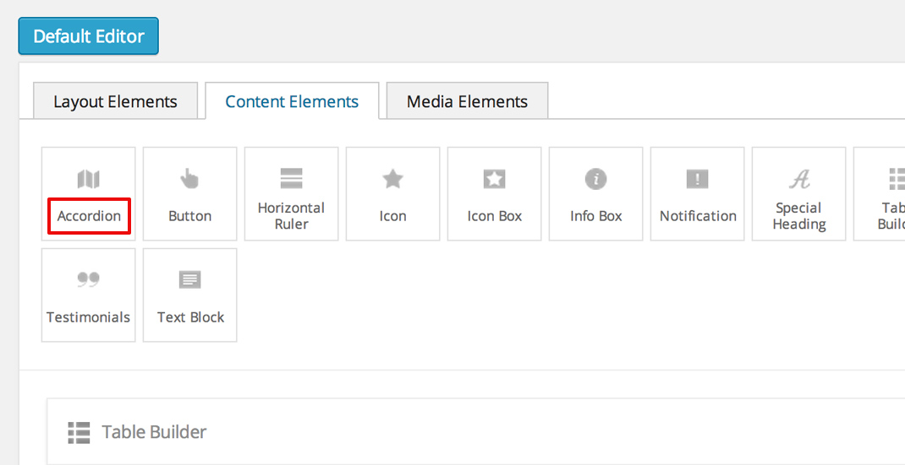
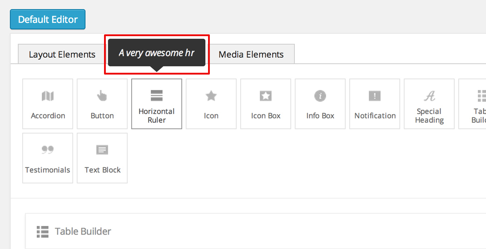
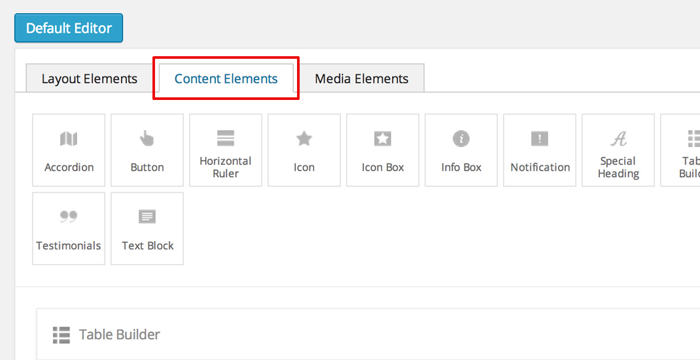
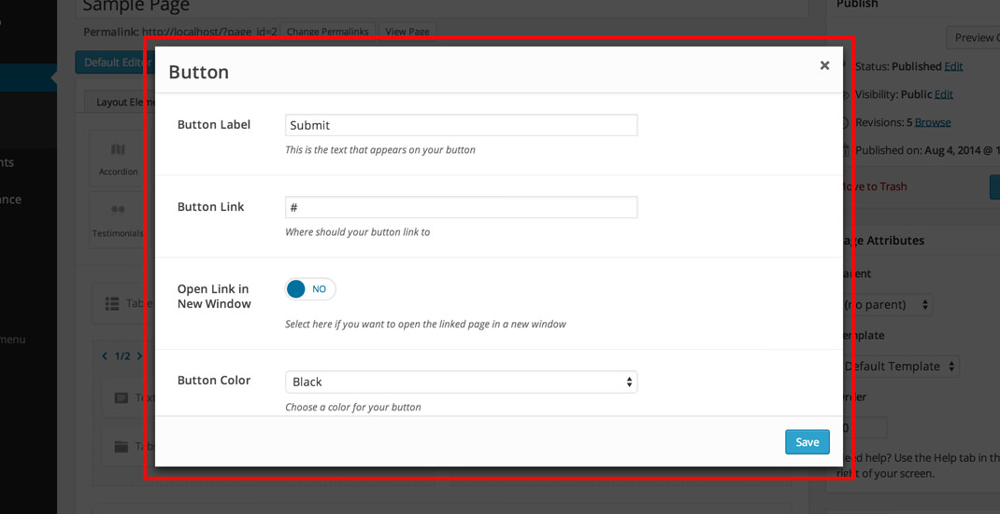
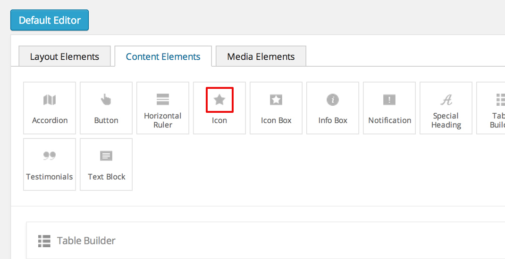
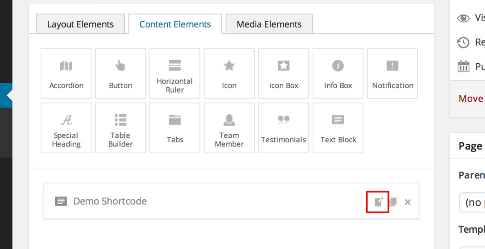
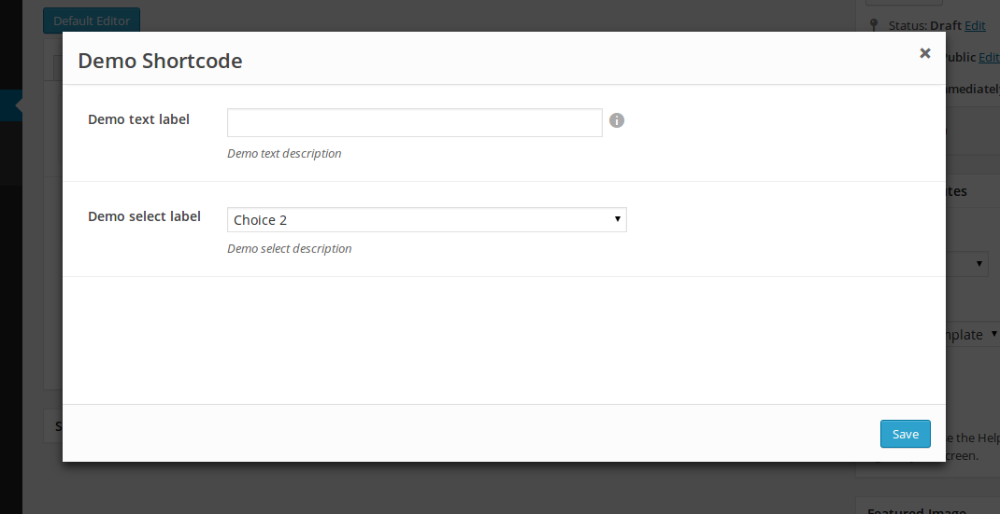
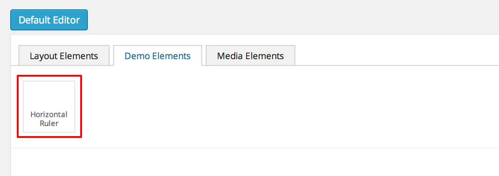

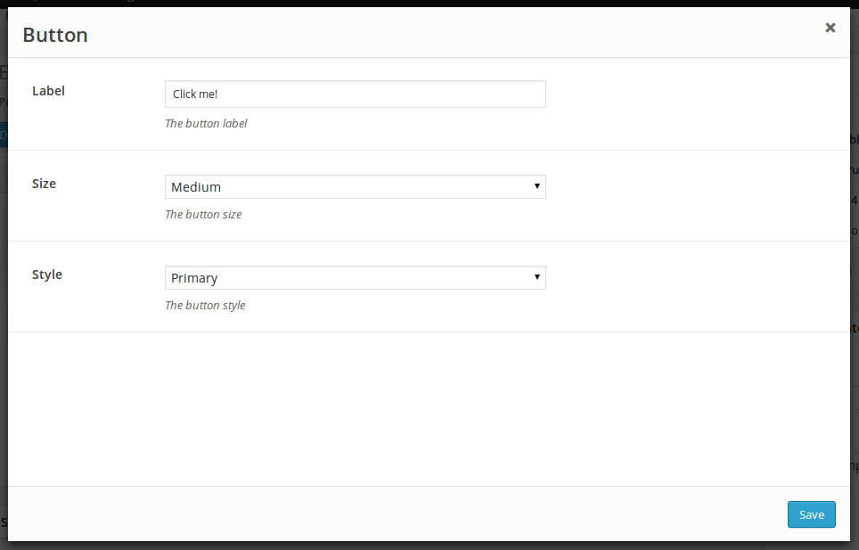
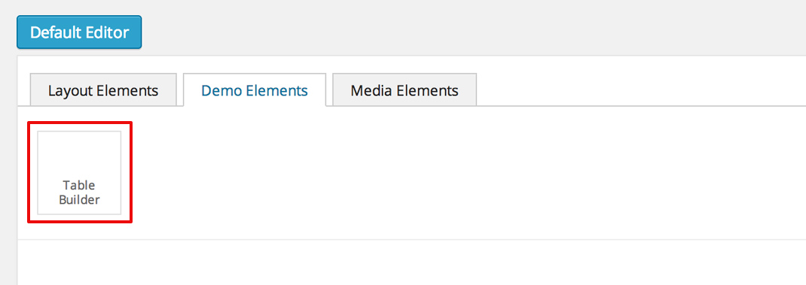
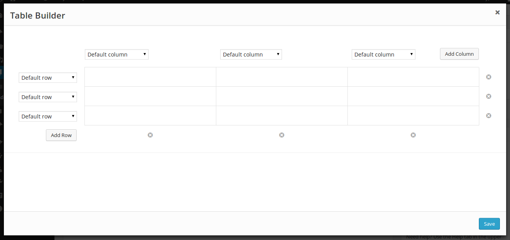
